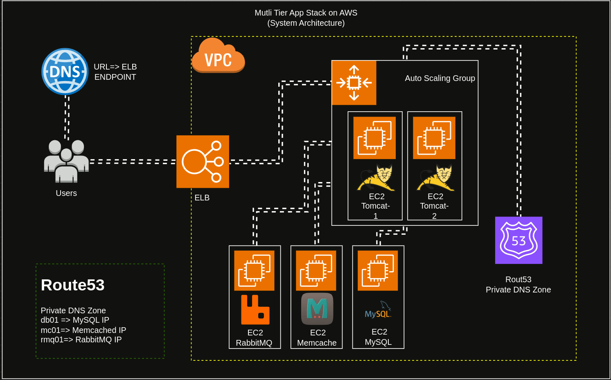

# 🏗️ Multi-Tier Application Infrastructure on AWS (Terraform)

This repository contains **Infrastructure as Code (IaC)** for deploying a **production-ready multi-tier web application architecture on AWS** using **Terraform**.

It provisions the complete AWS infrastructure required to run a scalable Tomcat-based application with supporting backend services.

---

## 📦 Prerequisites

* AWS Account
* Terraform `>= 1.5`
* AWS CLI configured
* IAM user with sufficient permissions

---
## 🏗️ Infrastructure Architecture


## 📌 Architecture Overview

The infrastructure follows a **classic 3-tier architecture**:

* **Presentation Layer**

  * Route53 (Public DNS)
  * Application Load Balancer (ALB)

* **Application Layer**

  * EC2 Auto Scaling Group (Tomcat)
  * Launch Template
  * IAM Role & Instance Profile

* **Backend Services (Private Subnet)**

  * EC2 MySQL
  * EC2 RabbitMQ
  * EC2 Memcached
  * Route53 **Private Hosted Zone**

* **Networking**

  * VPC
  * Public & Private Subnets
  * Internet Gateway
  * NAT Gateway
  * Security Groups

* **State Management**

  * S3 Backend
  * DynamoDB for Terraform state locking

---

## 🔐 Secrets & Configuration Management

Sensitive data is **never hardcoded**.

All secrets are stored securely using **AWS SSM Parameter Store**:

* `/prod/db/username`
* `/prod/db/password`
* `/prod/rabbitmq/username`
* `/prod/rabbitmq/password`
* `/prod/admin/username`
* `/prod/admin/password`

EC2 instances retrieve secrets at runtime using **IAM roles**.

---

## 📄 Sample `terraform.tfvars`

Create a file named **`terraform.tfvars`** in the `prod/` directory using the example below.

⚠️ **Important**

* This file contains sensitive values
* **Do NOT commit `terraform.tfvars` to Git**
* It is already added to `.gitignore`

---

### 🔧 `terraform.tfvars`

```
nano terraform-backend/terraform.tfvars
```
```
# terraform-backend/terraform.tfvars

# AWS Region
region = "us-east-1"

# Terraform Backend
bucket_name = "multi-tier-web-backend-bucket-123456"
```
```
nano ssm/terraform.tfvars
```
```
# ssm/terraform.tfvars

# Database Credentials (SSM Recommended)
db_username = "test_user"
db_password = "test_password"

# RabbitMQ Credentials
rabbitmq_username = "test_user"
rabbitmq_password = "test_password"

# Application Admin
admin_username = "test_user"
admin_password = "test_password"
```
```
nano prod/terraform.tfvars
```
```
# nano ssm/terraform.tfvars

# AWS Region
region = "us-east-1"

ami_id          = "ami-0ecb62995f68bb549"
instance_type  = "t2.micro"
aws_key_pair   = "vprofile-key"
availability_zone = "us-east-1a"

# Auto Scaling Group
min_size         = 2
max_size         = 5
desired_capacity = 3


# Terraform Backend
bucket_name = "multi-tier-web-backend-bucket-123456"
```

## 🚀 Deployment Flow (Recommended Order)

### 1️⃣ Create Terraform Backend (One-Time)

```bash
cd terraform-backend
terraform init
terraform apply
```

Creates:

* S3 bucket for state
* DynamoDB table for state locking

---

### 2️⃣ Create SSM Parameters

```bash
cd ssm
terraform init
terraform apply
```

---

### 3️⃣ Deploy Production Infrastructure

```bash
cd prod
terraform init
terraform apply
```

---

## 🔄 CI/CD Integration

This repository is designed to work with the **CI/CD pipeline** located in:

🔗 **Application CI/CD Repo:**
[https://github.com/Ajaz3800/multi-tier-app-github-action](https://github.com/Ajaz3800/multi-tier-app-github-action)

### CI/CD Responsibilities

* Build application
* Create AMI using Packer
* Update Launch Template AMI
* Trigger ASG rolling update

---

## 🔁 How Launch Template Updates Work

1. GitHub Actions builds a new AMI
2. AMI ID is passed to Terraform
3. Terraform updates Launch Template version
4. Auto Scaling Group rolls instances automatically

✅ **Zero downtime deployment**

---

## 🔒 IAM & Security Best Practices

* Least-privilege IAM roles
* Private subnets for backend services
* No hardcoded credentials
* ALB security group isolation
* NAT Gateway for outbound access only

---

## ⭐ Support

If you find this project helpful, please give it a star ⭐ on GitHub.

----

## 🌐 Connect With Me

<div align="center">
  
[](https://www.linkedin.com/in/shaikh-muhammad-ajaz)
[](mailto:shaikhajaz38000@gmail.com)
[](https://www.youtube.com/@devopswithajaz)
</div>

<div align="center">

[](https://upwork.com/freelancers/muhammadajaz)
[](https://www.fiverr.com/ajazshaikh3800)
</div>

---

<div align="center">
  
### 💡 "Turning ideas into production-ready systems."


[](https://github.com/Ajaz3800)

</div>